# Ovde ce biti objasnjenja cela struktura projekta i kako sve treba da izgleda

# Jos jedna jako bitna stvar. Kod treba napraviti tako da ovaj sajt koji se pravi bude templejt, da moze da se proda velikom broju korisnika uz manje i lake izmene (boje, fontovi, slike, kartice itd.). Logika ne treba da bude previse kompleksna, ali sigurnost treba da bude na visokom nivou. Znaci ovaj sajt se pravi tako da bude samo skica i nacrt, samo za pokazivanje klijentu sta moze da dobije, a gotov proizvod treba da se uradi za vrlo kratko vreme (1h uz manje izmene). Princip rada i sistem ostaju isti.
Znaci pravimo sistem ili fabriku za pravljenje sajtova za frizerske salone. Kada dodje klijent ovaj templejt se koristi da se napravi sajt za 1h uz manje izmene, ali da opet niko drugi ne moze ovo da uradi ili iskopira. Znaci mora da bude jedinstven i poseban.
(Template/Boilerplate): Praviš jedan repozitorijum. Kada dobiješ klijenta, ti kloniraš taj kod, promeniš .env varijable, prilagodiš boje kroz Tailwind config (ili kako ti mislis da treba) i deploy-uješ to na novi Vercel projekat za tog specifičnog klijenta. Baza je samo za jedan salon.

## Opste informacije
- Posto je template, salon se zove: "TestFriz"
- Adresa je: "Ulica Testova 123, Beograd"
- Telefon je: "0601234567"
- Email je: [testfriz@gmail.com]"
- Sve slike u fajlu se nalaze u projektu vec pod tim imenima

## Opsti izgled
Ceo izgled treba da izgleda jednostavno, cisto, sa nekim linearnim gradijentima. Ne treba imati mnogo mracnih boja.
Sve treba da bude smooth i lagano i da se brzo ucitava.
Sajt mora biti skalabilan i na manjim ekranima.
Svuda se pise na srpskom jeziku i strogo ovo prati.
Valuda je srpski dinar (RSD).

## Dizajn
Treba koristiti fontove koji su cisti i lako citljivi. Dizajn je noviji, ne sme imati izgled kao da je pravljeno u Wordpress-u.
Skrol bar treba da se svuda uklapa sa dizajnom ostalih delova
Boje koje koristis treba da budu blage ne previse da bodu oci, ali mozes da koristis i tople i hladne boje, samo ne previse jarke, da privlace da korisnik ostane sto duze.
Koristi i glassmorphism.
Za tamnu temu koristi duboke, misteriozne nijanse sive (npr. cink ili siva iz Tailwinda sa visokim kontrastom za tekst), uz diskretne, jedva primetne border-e oko glassmorphism kartica. Ikone treba da budu oštre i minimalističke (npr. Lucide React).

## Preporucene tehnologije (ne mora ako imas bolje)
1. Next js
2. Tailwind css
3. TypeScript
4. Prisma
5. PostgreSQL (sa Supabase)
6. Vercel (za deploy)
7. Clerk (za auth)

-----

## Principi koji moraju da se postuju
1. Bez kucanja nepotrebnog koda
2. DRY princip
3. Cista arhitektura
4. Skalabilan kod
5. Lako izmenljiv kod
6. Dokumentovan kod
7. Treba obratiti paznju na bezbednost
8. Treba biti SEO optimizovan
9. Cist i razumljiv kod
10. Stednja tokena ako je moguce

-----

## ARHITEKTURA SAJTA
## Bitna stavka je takodje da imamo 2 uloge u sistemu: Admin(Owner i osoba koja vodi sistem) i Radnik

### Glavna stranica ("/")

#### Navigacija
- Treba da ima logo (klik na logo vraca na vrh stranice pocetne), linkove ka delovima stranice (About, Galerija, Iskustva, Usluge, Kontakt) i dugme koje vodi ka stranici za zakazivanje. Treba da ima i skroz desno staff login koji vodi na stranicu dashboard, ali pre toga ga clerk zaustavlja da se uradi login (sign in) i da bude dodat u radnike. Svaki ovaj login razlikuje uloge u sistemu.
- I treba negde da ima toggle za dark/light temu, kada se stavi jedno to se prenosi i na druge stranice.

#### Hero sekcija
- Treba da ima naslov, neku recenicu koja zvuci lepo i govori lepo o salonu, mozda neka veca slika u pozadini, ali mozda je bolje i bez. Treba da ima i dugme koje vodi ka stranici za zakazivanje.

#### About Sekcija
- Kratko o lokalu, kako je nastao, za sta se zalaze, sta nudi i neke dodatne slike koje idu uz to.

#### Galerija
- Slike pre i posle, i neke slike sa instagrama. Maksimalno 5 slika. Moze da se napravi i onaj neki kao slider kao pre i posle.

#### Iskustva drugih ljudi (Recenzije)
- 3-4 kartice koje imaju zvezdice kao na guglu i govore o lokalu, ime prezime, slika na guglu i lep komentar.

#### Usluge
- Sve usluge koje salon pruza po karticama napravljenje (koje su interkativne, ne da bukvalno budu clickable nego samo da budu "zive"). Svaka kartica ima ime usluge, kratak opis i cenu. Kartice se povlace iz baze i mogu se dodavati i brisati iz dashboard-a koji moze da menja samo glavni admin.

#### Kontakt
- Imamo tabelu za radno vreme od kad do kad se radi i to se azurira automatski iz baze podataka. Ti podaci se menjaju u dashboard-u. Moze da ih menja samo glavni admin.
- Imamo broj telefona, email i adresu.
- Imamo Opet ime salona, nesto kratko o njemu i linkove ka drustvenim mrezama (instagram, facebook, tiktok).

#### Footer (autorska prava)
- Samo autorska prava su ovde napisana. Na engleskom jeziku.

### Dashboard stranica ("/dashboard")

#### Ovo je prva strana na ovom velikom panelu
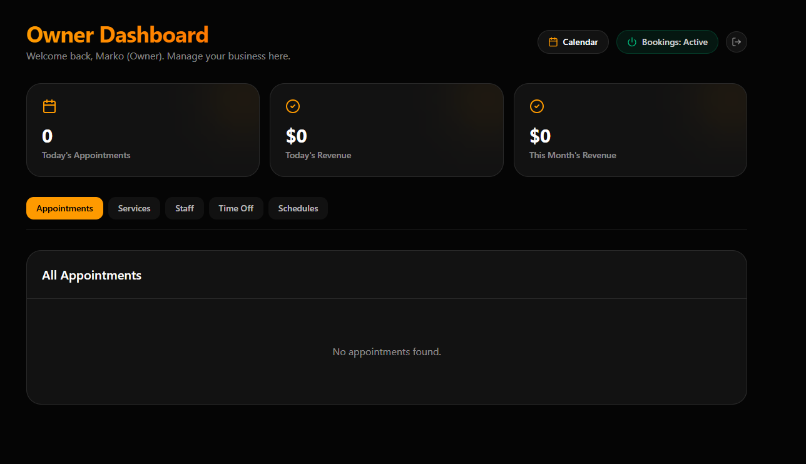
Treba da se na serveru obavljaju ovi racuni za dnevni i mesecni nivo i da se ovde pojavljuju klijenti koji zele termin pa postoje opcije:
- Prihvatiti termin i odbiti termin, sa ikonicama.
Ovde postoji opcija da klijent koji je zakazao termin moze da ga otkaze i onda ako je u pending statusu termin se samo obrise ali ako je vec prihvacen termin onda ovde tom radniku stize obavestenje kratko da je klijent poslao zahtev za ukljanjanje termina. Termin ne moze da se ukloni 18 sati pre zakazog termina ili manje.
NE SME IMATI VISE LJUDI U ISTOM TERMINU.
- I treba negde da ima toggle za dark/light temu, kada se stavi jedno to se prenosi i na druge stranice. Treba da bude negde gore levo ili tako negde da ne privlaci mnogo paznje.
I svaki frizer (Radnik) vidi samo svoje klijente i samo ovu pocetnu stranicu i times of stranicu gde moze samo da posalje (upise zasto neki dan ne moze da radi). Sve ostalo (Services, Staff, Schedules, Time Off za sve radnike) vidi samo admin.
- Treba da postoji kalendar kao sto je na slici koji je vizuelno prikazan ovako:
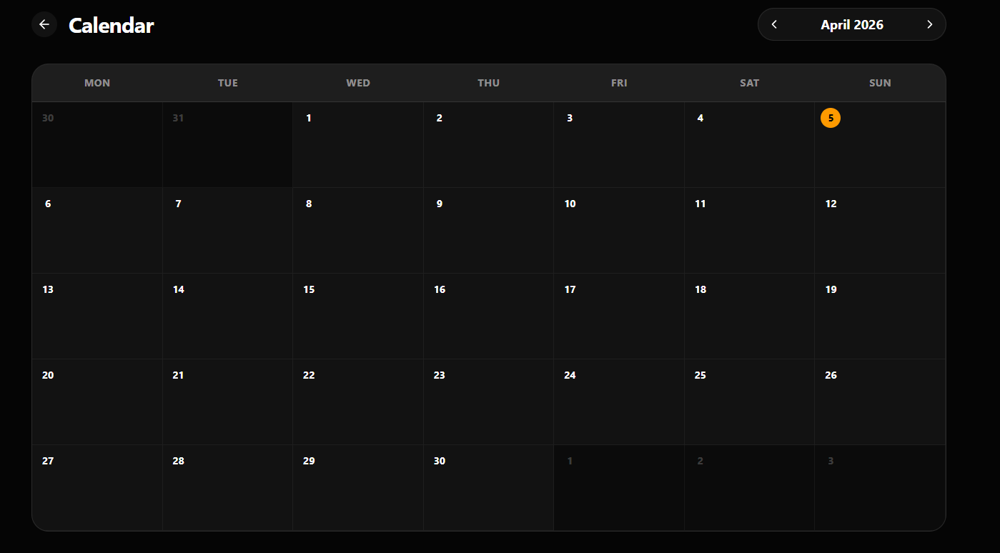 i treba da bude svaki klijent lepo obelezen i da svaki radnik u kalendaru vidi samo svoje klijente i da nema mnogo detalja u kalendaru, vec se detalji nalaze na ovom panelu dole. Znaci treba da bude pregledno i lepo.
- Ovo dugme Bookings: Active, treba da pise "Zakazivanja: Ukljucena" a ako se pritisne onda iskljucena, a to znaci da se na stranici zakazivanje ispisuje kartica ("Trenutno ne mozete zakazati termin") i da se ti procesi stopiraju.
## NE KORISTI ISTI IZGLED KAO OVDE, ALI POGLEDAJ KAKO JE DOBRO URADJENO PA ISKORISTI NEKE STAVKE (NA PRIMER GRADIENT I SENKU)

#### Evo kako izgledaju ostale stranice ovde
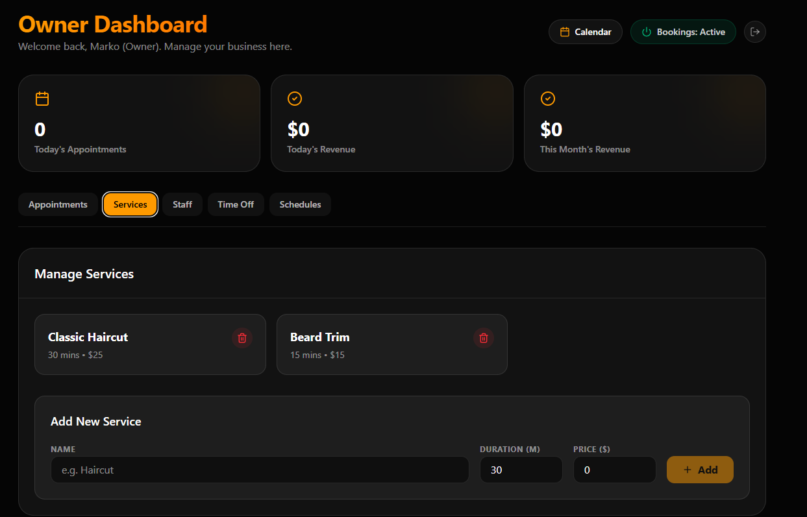
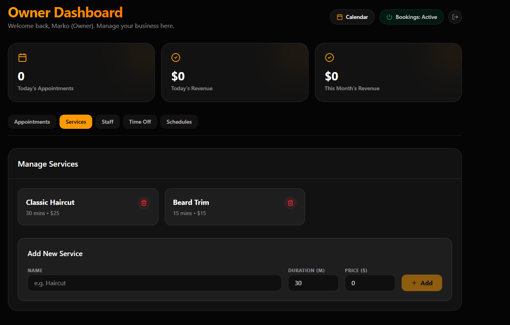
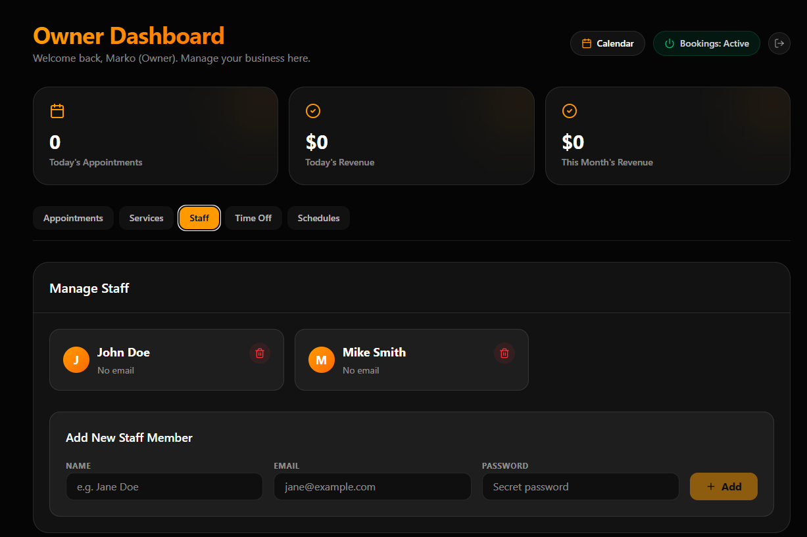
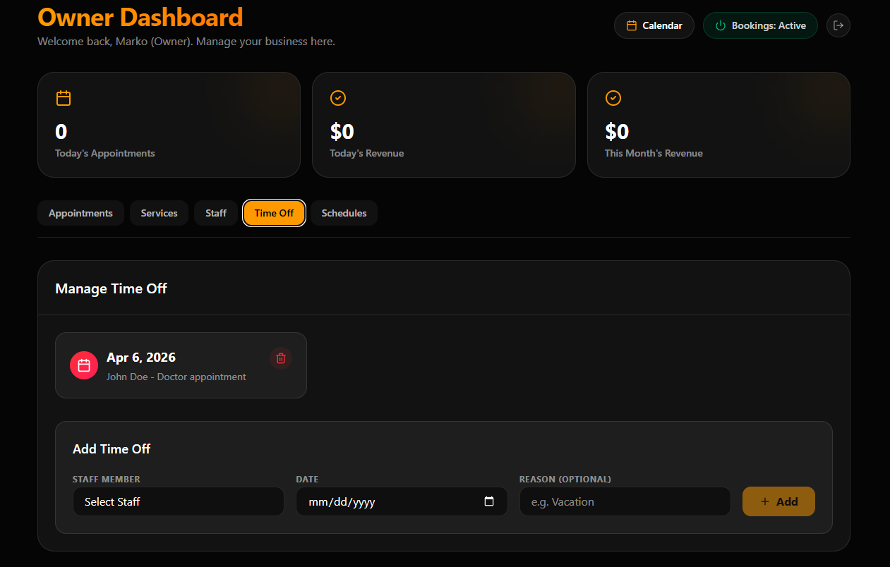
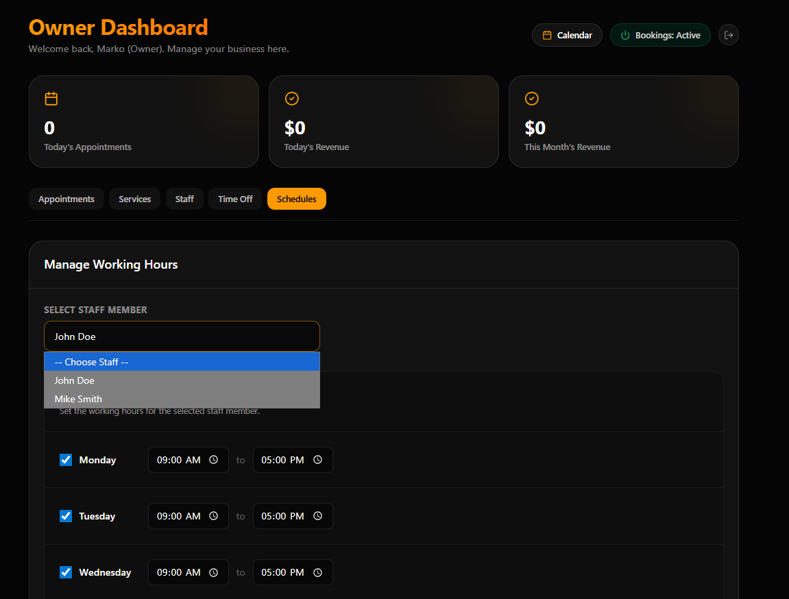

### Status stranica ("/status")
- 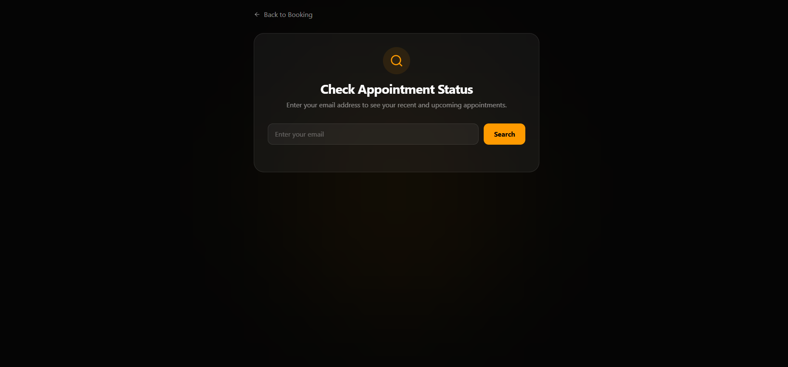
- Ovo radi tako sto pretrazuje po mejlu klijetna i prikazuje mu svu istoriju sisanja poslednjih 20 dana (sve pre toga se brise sistemski i automatski), i da li ima termin koji je zakazao (prikazuje mu status).
- Tu ima i opciju da otkaze termin po pravilima koja sam ti vec rekao, ako termin ne moze da se obrise vec se salje zahtev frizeru (radniku), treba da mu se ispise privremena poruka obavestenja (koja traje 3 sekunde i nestaje).

### Booking stranica ("/zakazivanje")
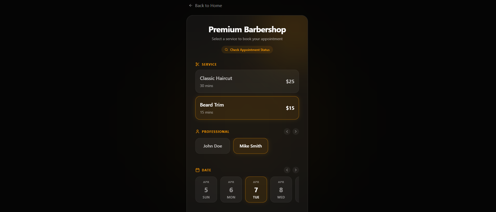
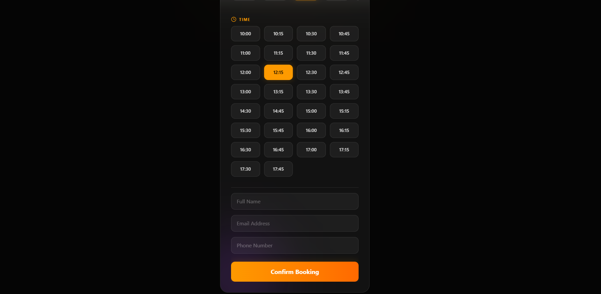

- Ovo treba da radi tako sto se prikazuju stavke jedna po jedna (na pocetku je samo prva stavka i kada se klikne na nesto onda se otvaraju ostale, a prethodne ostaju vidljive)
- Sve ostalo vidis sa slike, neka ove strelice za levo i desno rade samo.
- I kada se zavrsi booking (treba da pise zakazi ili posalji zahtev), onda ako je sve uspesno treba da se prikaze poruka da je uspelo i da se ponudi opcija da se ode na pocetnu stranu ("/") ili da se opet zakaze jos jednom (vodi na "zakazivanje").
- Ako je stranica pauzirana, onda treba da se ispisu one poruke odgovarajuce i da se doda dugme refresh i Nazad na pocetnu stranu.

### Login stranica
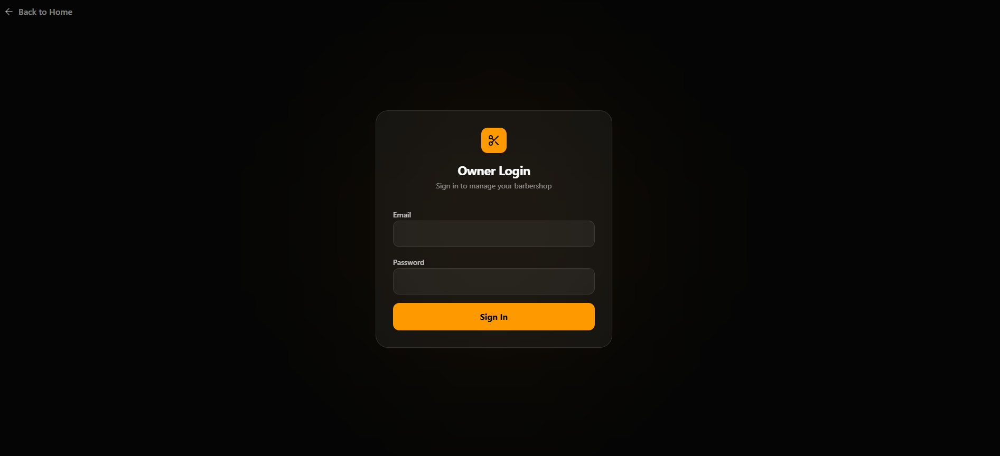

#### Ne smeju da se prikazuju dani koji su prosli. vec samo buduci moguci termini koji nisu zauzeti. I najdalje moze da se zakaze za dve nedelje.

-----

## Baza podataka (Prisma Schema struktura)
Treba napraviti bazu podataka koja ce biti skalabilna i koja ce moci da se koristi za vise korisnika. Brisanje posle 20 dana treba da bude obavezno, ne brise se sve.

Baza treba da bude optimizovana za PostgreSQL (Supabase) preko Prisma ORM-a. Zbog brzine i jednostavnosti, koristi sledeću strukturu modela:

User (Radnici i Admini)

Povezuje se sa Clerk-om (clerkUserId string koji je unique).

Polja: id, clerkUserId, name, email, role (Enum: ADMIN, STAFF).

Relacije: Može da ima više svojih Appointment (klijenti koji su kod njega zakazali) i više TimeOff unosa.

Service (Usluge salona)

Polja: id, name, description, price (Int ili Float), durationMinutes (Int).

Usluge kreira i menja samo Admin.

Appointment (Zakazani termini)

Polja: id, clientName, clientEmail (bitno za /status stranicu), clientPhone, startTime (DateTime), endTime (DateTime).

status (Enum: PENDING, APPROVED, CANCELLED_BY_CLIENT, REJECTED).

Relacije: Povezan sa User (koji radnik pruža uslugu) i Service (koja usluga se radi).

TimeOff (Slobodni dani radnika)

Polja: id, date (DateTime), reason (String).

Relacije: Povezan sa User (radnik koji ne radi tog dana).

**SalonSettings (Globalna podešavanja)**
Sadrži radno vreme i toggle za pauziranje sajta.

Polja: id, isBookingActive (Boolean - povezano sa onim dugmetom "Zakazivanja: Ukljucena"), openingTime, closingTime. (Može biti samo jedan red u ovoj tabeli).

Pravilo inicijalizacije: Mora postojati prisma/seed.ts skripta koja će, prilikom prvog setup-a baze, automatski upisati tačno jedan red sa fiksiranim id: "global". Svi backend pozivi u aplikaciji za proveru radnog vremena i "isBookingActive" toggle-a moraju tražiti isključivo where: { id: "global" } kako bismo izbegli kreiranje višestrukih redova za ista podešavanja.

Svi modeli treba da imaju createdAt i updatedAt polja. Voditi računa o brisanju (Cascade delete) – ako se obriše radnik, šta se dešava sa njegovim terminima.

## Testovi
Treba da napravis testove i da proveris da li sve radi i da li postoji nacin da korisnik zezne sitem ili da ga obori, i da naravno postoji li nacin da se nekako udje u sajt i gde su slabe tacke.
